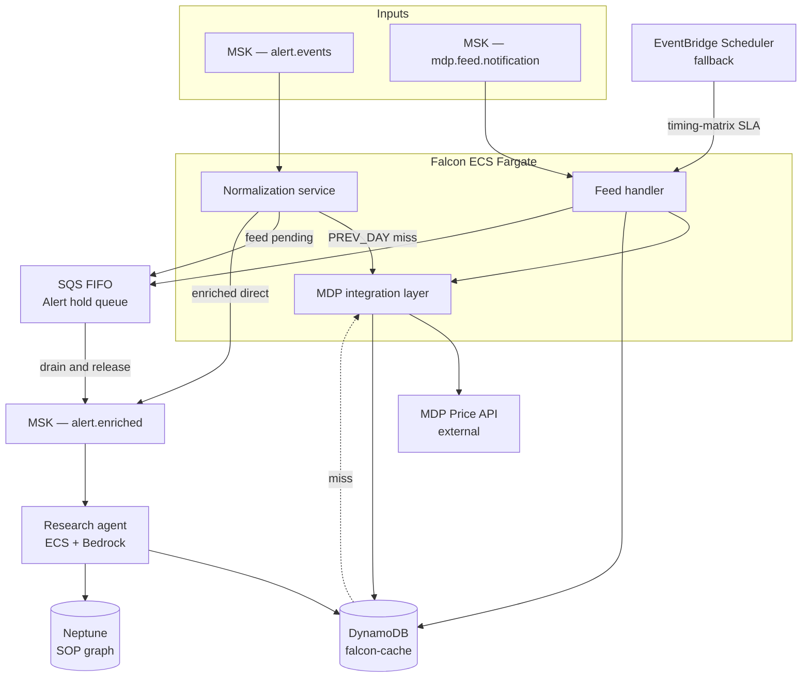

# Falcon — MDP Pricing Architecture & Design

**Version:** 3.0  
**Status:** Draft for review  
**Audience:** Falcon engineering, MDP integration, data operations

---

## 1. Overview

Falcon ingests pricing alerts from EPW and DAS, enriches each alert with prices from MDP (the firm's Bloomberg-sourced price store), and hands the enriched alert to a Research Agent for automated root-cause analysis. The Research Agent also has direct access to MDP data (prices, security master, corporate actions) via a tool backed by the same cache.

This document covers the end-to-end design: normalisation, price basis identification, feed notification handling, alert queuing, cache population, and the Research Agent MDP tool. It also defines the DynamoDB schema, TTLs, and AWS service mapping.

---

## 2. Scope

**In scope**
- Alert normalisation and routing
- Feed notification handling (MDP ready event per region + asset type)
- Alert hold queue (SQS FIFO) and release mechanism
- DynamoDB cache — prices, security master, corporate actions
- Research Agent MDP tool
- AWS service mapping and architecture

**Out of scope (interfaces defined here, internals separate modules)**
- Price basis resolution logic (EPW valuation point → price type mapping, DAS default)
- INTRADAY implementation details (schema placeholder included)
- Price group / client onboarding workflow

---

## 3. Assumptions

### 3.1 Price Basis Module (separate)

The determination of which price type (PREV_DAY_CLOSE / CURR_DAY_CLOSE / INTRADAY) applies to an alert is owned by a **Price Basis Resolver** module. This document defines its interface only.

```
PriceBasisResolver.resolve(
  source:       "EPW" | "DAS",
  priceGroupId: string,
  region:       "EMEA" | "APAC" | "NAMR" | "LAMR",
  assetType:    string
) → PriceType: "PREV_DAY_CLOSE" | "CURR_DAY_CLOSE" | "INTRADAY"
```

The result is stored in DynamoDB (`PRICEBASIS` entity) and cached in-memory at Normalisation Service startup, refreshed every 15 minutes.

### 3.2 MDP Feed Notification Signal

MDP publishes **one notification event per (region, assetType) per business day** once the full price load for that feed cell is complete. This is a signal only — no price data is included.

**Event payload (MSK topic `mdp.feed.notification`):**
```json
{
  "region":      "EMEA",
  "assetType":   "CommonStock",
  "businessDate": "2024-01-15",
  "notifiedAt":  "2024-01-15T16:35:00Z",
  "feedCellId":  "EMEA#CommonStock"
}
```

On receiving this event, Falcon calls MDP's price API to pull prices for the securities it needs.

### 3.3 Sync Service — Per-Security Exception Pull

When a price is needed immediately and cannot wait for the feed notification (PREV_DAY_CLOSE cache miss, or Research Agent tool cache miss), Falcon calls MDP's price API directly for that one security. This is the **exception pull** — the synchronous single-security path. It is not the primary flow and should not be used as a substitute for feed-driven cache population.

### 3.4 PREV_DAY_CLOSE Availability

PREV_DAY_CLOSE data is always retrievable from MDP (yesterday's feed has already completed by the time today's alerts arrive). If absent from cache, Falcon performs an exception pull. PREV_DAY_CLOSE alerts **never queue** against today's feed notification — they are independent of today's feed cycle.

### 3.5 INTRADAY

INTRADAY is a future extension. Schema includes it as a placeholder with the same structure as CURR_DAY_CLOSE. Processing logic falls through to CURR_DAY_CLOSE behaviour for now.

### 3.6 Security Universe — Organic Discovery (Option C)

There is no pre-defined security universe. The cache populates as alerts are processed and feed notifications arrive. On first encounter of a security, an exception pull warms the cache. Subsequent cycles use the feed-notification-driven path.

### 3.7 One Alert, One Security

Each alert references exactly one security. No multi-security alert batching is required at the alert level.

### 3.8 Price Basis at Client / Price Group Level

Price type is maintained at the client / price group level (not security level). The `PRICEBASIS` entity stores the mapping `(priceGroupId, region, assetType) → priceType`. A security can have different price types for different price groups — the alert carries the `priceGroupId` used to resolve it.

---

## 4. High-Level Flow

```
Alert arrives (from EPW or DAS)
  → MSK alert events topic

Normalisation Service (ECS Fargate)
  → parse: instrumentId, region, assetType, priceGroupId, businessDate
  → resolve price type via PriceBasisResolver

  if priceType == PREV_DAY_CLOSE:
      → check DynamoDB cache (PRICE entity, previous businessDate)
      → HIT:  enrich alert → MSK enriched topic → Research Agent
      → MISS: exception pull from MDP → write cache → enrich → Research Agent
      [never queue]

  if priceType == CURR_DAY_CLOSE or INTRADAY:
      → check DynamoDB FEED_STATE for (region, assetType, businessDate)
      → COMPLETE: check price cache
                  → HIT:  enrich → Research Agent
                  → MISS: exception pull → write cache → enrich → Research Agent
      → PENDING:  publish to SQS FIFO queue (MessageGroupId = "region#assetType#businessDate")

MDP ready event arrives
  → MSK feed notification topic
  → Feed Handler (ECS Fargate)
      → idempotency: write FEED_STATE = COMPLETE (conditional)
      → call MDP price API for all unique instruments in queued alerts
      → write prices to DynamoDB
      → enrich each queued alert with fetched price
      → publish enriched alerts to MSK enriched topic
      → delete SQS messages

Research Agent (ECS + Bedrock)
  → receives enriched alert (primary price already attached)
  → uses MDP Tool for additional data (comparison prices, security master, corporate actions)
      → cache check → HIT: return | MISS: exception pull → cache → return
  → uses Neptune for SOP guidance
```

---

## 5. Component Design

### 5.1 Normalisation Service

**Runtime:** ECS Fargate, stateless, horizontally scalable.  
**Input:** MSK `alert.events` topic.  
**Output:** MSK `alert.enriched` topic (direct path) OR SQS FIFO queue (hold path).

Responsibilities:
1. Parse alert and extract pricing context: `instrumentId`, `region`, `assetType`, `priceGroupId`, `businessDate`.
2. Resolve `priceType` via PriceBasisResolver lookup (DynamoDB `PRICEBASIS`, in-memory cache).
3. Route by price type (see §4).
4. On exception pull: call MDP Integration Layer, write to DynamoDB, proceed.

### 5.2 Feed Notification Handler

**Runtime:** ECS Fargate (or Lambda if workload is bursty — one event per feed cell per day).  
**Input:** MSK `mdp.feed.notification` topic.

Responsibilities:
1. Receive ready event.
2. Idempotency guard (DynamoDB conditional write).
3. Drain SQS FIFO queue for the feed cell.
4. Deduplicate instruments across queued alerts.
5. Batch call MDP via MDP Integration Layer.
6. Write prices to DynamoDB.
7. Enrich and release all queued alerts.

### 5.3 MDP Integration Layer

**Runtime:** ECS Fargate, shared by Normalisation, Feed Handler, and Research Agent tool.

Centralised MDP client with:
- Connection pooling
- Rate limiting and backoff
- Circuit breaker
- Three methods: `getPrice()`, `getSecurityMaster()`, `getCorporateActions()`

### 5.4 Research Agent MDP Tool

Input: `(instrumentId, region, assetType, dataType, priceType?, businessDate?)`

```
1. Build DynamoDB key from inputs
2. Query DynamoDB
3. HIT  → return data to agent
4. MISS → call MDP Integration Layer
         → write to DynamoDB with standard TTL
         → return data to agent
```

Handles `dataType ∈ { PRICE, SECMASTER, CORPACTION }`.

---

## 6. Queue Logic — Detailed Design

### 6.1 Queue Architecture

| Attribute | Value |
|-----------|-------|
| Queue type | Amazon SQS FIFO |
| MessageGroupId | `{region}#{assetType}#{businessDate}` e.g. `EMEA#CommonStock#2024-01-15` |
| MessageDeduplicationId | `{alertId}` |
| Visibility timeout | Feed SLA "latest" time from timing matrix + 2 h buffer |
| Message retention | 24 h |
| Dead letter queue | Enabled, `maxReceiveCount = 3` |

### 6.2 Enqueue Condition

An alert is queued only when **all** of the following are true:
- `priceType ∈ { CURR_DAY_CLOSE, INTRADAY }`
- DynamoDB FEED_STATE for `(region, assetType, businessDate)` is PENDING or absent

If FEED_STATE is already COMPLETE at the time of the check, the alert proceeds directly to the cache check — never queued.

**Message body:**
```json
{
  "alertId":       "uuid",
  "instrumentId":  "US0231351067",
  "region":        "EMEA",
  "assetType":     "CommonStock",
  "priceType":     "CURR_DAY_CLOSE",
  "businessDate":  "2024-01-15",
  "priceGroupId":  "PG001",
  "alertPayload":  { "...": "full normalised alert" },
  "queuedAt":      "2024-01-15T13:00:00Z"
}
```

### 6.3 Drain Process (Feed Notification Arrives)

**Step 1 — Idempotency guard**
```
DynamoDB.updateItem(
  PK = "FEEDSTATE#EMEA#CommonStock",
  SK = "2024-01-15",
  SET status = "COMPLETE", notifiedAt = now(),
  ConditionExpression = "attribute_not_exists(status) OR status = :pending"
)
```
If condition fails → already processed → stop. No reprocessing.

**Step 2 — Drain SQS queue**
```
messages = []
while True:
    batch = SQS.receive_message(
        MessageGroupId = "EMEA#CommonStock#2024-01-15",
        MaxNumberOfMessages = 10,
        WaitTimeSeconds = 5
    )
    if len(batch) == 0: break
    messages.extend(batch)
```

**Step 3 — Deduplicate instruments**
```
uniqueInstruments = list({ msg.instrumentId for msg in messages })
```

**Step 4 — Batch pull from MDP**
```
prices = MDP.batchGetPrices(
    instruments = uniqueInstruments,
    priceType   = "CURR_DAY_CLOSE",
    businessDate = "2024-01-15"
)
```
If MDP supports multi-security queries: one call. If single-security only: parallel calls, concurrency limit = 10, with rate limiting.

**Step 5 — Write to DynamoDB**
```
for (instrument, price) in prices.items():
    DynamoDB.put_item(
        PK  = f"PRICE#{instrument}#EMEA#CommonStock",
        SK  = "CURR_DAY_CLOSE#2024-01-15",
        price      = price.value,
        currency   = price.currency,
        source     = "MDP_FEED",
        cachedAt   = now(),
        TTL        = next_midnight_unix_epoch
    )
```

**Step 6 — Release alerts**
```
for msg in messages:
    price = DynamoDB.get_item(
        PK = f"PRICE#{msg.instrumentId}#EMEA#CommonStock",
        SK = "CURR_DAY_CLOSE#2024-01-15"
    )
    enrichedAlert = { ...msg.alertPayload, "price": price }
    MSK.publish("alert.enriched", enrichedAlert)
    SQS.delete_message(msg.receiptHandle)
```

### 6.4 Error Handling

| Scenario | Handling |
|----------|----------|
| MDP call fails | Retry ×3, backoff: 2 s, 4 s, 8 s. After exhaustion: release alert with `priceAvailable: false`, move to DLQ. |
| MDP returns no price for a specific instrument | Mark `priceAvailable: false` for that alert only. Other alerts proceed. |
| SQS visibility timeout expires | Message returns to queue. After `maxReceiveCount = 3`: DLQ. DLQ consumer releases with `priceAvailable: false` and fires CloudWatch alarm. |
| Duplicate feed notification | Idempotency guard at Step 1 prevents reprocessing. |
| Feed notification never arrives | 24 h SQS retention expires → DLQ → release with `priceAvailable: false`. EventBridge fallback scheduler fires at timing-matrix "latest" time as a backup trigger. |
| System restart mid-drain | SQS visibility timeout returns in-flight messages to queue. Feed Handler re-checks FEED_STATE (already COMPLETE) and re-processes the remaining queue. |

### 6.5 PREV_DAY_CLOSE Fast Path

```
1. priceType = PREV_DAY_CLOSE, businessDate = today
2. Cache key: PK = "PRICE#<instrumentId>#<region>#<assetType>",  SK = "PREV_DAY_CLOSE#<yesterday>"
3. DynamoDB HIT  → attach price → MSK enriched topic → Research Agent
4. DynamoDB MISS → MDP exception pull → write to DynamoDB (TTL = 48 h) → attach → publish
```

Never queued. Never waits for today's feed notification. This is the **sync service per security (exception basis)** for PREV_DAY_CLOSE.

### 6.6 Idempotency Summary

| Component | Mechanism |
|-----------|-----------|
| Feed Handler activation | DynamoDB conditional write (`status != COMPLETE`) |
| SQS deduplication | FIFO `MessageDeduplicationId = alertId`, 5-min window |
| DynamoDB price write | Conditional on `attribute_not_exists(cachedAt)` unless explicit refresh |
| Exception pull dedup | Application-level single-flight per `(instrumentId, priceType, businessDate)` |

---

## 7. DynamoDB Schema

### 7.1 Design Principles

- **Single-table design**: one table (`falcon-cache`) for all entities.
- **PK prefix convention**: entity type prefix (PRICE, SECMASTER, CORPACTION, FEEDSTATE, PRICEBASIS) provides a clear namespace.
- **TTL attribute on every item**: automatic expiry via DynamoDB TTL.
- **Separation by data type**: each prefix has its own access pattern and can scale independently.

### 7.2 Table: `falcon-cache`

**Partition key (PK):** string  
**Sort key (SK):** string  
**TTL attribute:** `ttl` (Unix epoch, numeric)

---

#### Entity: PRICE

| Key | Pattern | Example |
|-----|---------|---------|
| PK | `PRICE#{instrumentId}#{region}#{assetType}` | `PRICE#US0231351067#EMEA#CommonStock` |
| SK | `{priceType}#{businessDate}` | `CURR_DAY_CLOSE#2024-01-15` |

**Attributes:** `price` (Decimal), `currency` (String), `source` (MDP_FEED \| MDP_EXCEPTION), `feedCell` (String), `cachedAt` (ISO), `ttl` (epoch)

**TTL by price type:**

| Price type | TTL |
|------------|-----|
| PREV_DAY_CLOSE | businessDate + 48 h (covers weekend rollover) |
| CURR_DAY_CLOSE | businessDate + 24 h |
| INTRADAY | businessDate + 12 h |

---

#### Entity: SECURITY_MASTER

| Key | Pattern | Example |
|-----|---------|---------|
| PK | `SECMASTER#{instrumentId}` | `SECMASTER#US0231351067` |
| SK | `{asOfDate}` | `2024-01-15` |

**Attributes:** `name`, `isin`, `cusip`, `assetType`, `region`, `exchange`, `currency`, `status` (ACTIVE \| INACTIVE), `cachedAt`, `ttl`

**TTL:** cachedAt + 24 h (refreshed daily by Research Agent on first lookup per day)

**Access pattern:** point lookup on today's date. On miss: exception pull for today's snapshot.

---

#### Entity: CORPORATE_ACTION

| Key | Pattern | Example |
|-----|---------|---------|
| PK | `CORPACTION#{instrumentId}` | `CORPACTION#US0231351067` |
| SK | `{effectiveDate}#{actionType}#{actionId}` | `2024-01-15#DIVIDEND#CA001` |

**Attributes:** `actionType` (DIVIDEND \| SPLIT \| MERGER \| SPIN_OFF), `amount`, `currency`, `ratio`, `exDate`, `payDate`, `cachedAt`, `ttl`

**TTL:** effectiveDate + 30 days

**Access pattern:** range scan — query PK with SK between `{fromDate}#` and `{toDate}~`.

---

#### Entity: FEED_STATE

| Key | Pattern | Example |
|-----|---------|---------|
| PK | `FEEDSTATE#{region}#{assetType}` | `FEEDSTATE#EMEA#CommonStock` |
| SK | `{businessDate}` | `2024-01-15` |

**Attributes:** `status` (PENDING \| COMPLETE), `notifiedAt`, `processedAt`, `securitiesFetched` (Number), `ttl`

**TTL:** businessDate + 48 h

---

#### Entity: PRICE_BASIS_CONFIG

| Key | Pattern | Example |
|-----|---------|---------|
| PK | `PRICEBASIS#{priceGroupId}` | `PRICEBASIS#PG001` |
| SK | `{region}#{assetType}` | `EMEA#CommonStock` |

**Attributes:** `priceType` (PREV_DAY_CLOSE \| CURR_DAY_CLOSE \| INTRADAY), `effectiveFrom`, `updatedAt`

**TTL:** none (config data, no expiry)

---

### 7.3 Global Secondary Index

| GSI name | GSI PK | GSI SK | Purpose |
|----------|--------|--------|---------|
| `feedcell-date-index` | `feedCell` (= region#assetType) | `businessDate` | Feed Handler: list all cached prices for a feed cell on a given date |

---

### 7.4 TTL Summary

| Entity | TTL |
|--------|-----|
| PRICE — PREV_DAY_CLOSE | businessDate + 48 h |
| PRICE — CURR_DAY_CLOSE | businessDate + 24 h |
| PRICE — INTRADAY | businessDate + 12 h |
| SECURITY_MASTER | cachedAt + 24 h |
| CORPORATE_ACTION | effectiveDate + 30 days |
| FEED_STATE | businessDate + 48 h |
| PRICE_BASIS_CONFIG | no TTL |

---

## 8. End-to-End Flows

### 8.1 PREV_DAY_CLOSE — Fast Path

```
Alert: instrumentId=X, priceGroupId=PG001, region=EMEA, assetType=CommonStock
PriceBasisResolver → PREV_DAY_CLOSE

DynamoDB get: PK="PRICE#X#EMEA#CommonStock" SK="PREV_DAY_CLOSE#2024-01-14"
→ HIT:  enrich → MSK enriched topic → Research Agent       (~<50 ms)
→ MISS: MDP.getPrice(X, PREV_DAY_CLOSE, 2024-01-14)
        → DynamoDB put (TTL = 48 h)
        → enrich → Research Agent                           (~<500 ms)
```

### 8.2 CURR_DAY_CLOSE — Feed Not Yet Arrived

```
Alert: X, CURR_DAY_CLOSE, 2024-01-15, EMEA, CommonStock
FEEDSTATE#EMEA#CommonStock / 2024-01-15 → status = PENDING
→ SQS.publish(MessageGroupId="EMEA#CommonStock#2024-01-15")

[alert waits]

MDP publishes ready event: { region:EMEA, assetType:CommonStock, businessDate:2024-01-15 }
Feed Handler:
  1. FEEDSTATE → COMPLETE (conditional write)
  2. SQS drain: [X, Y, Z, …]
  3. uniqueInstruments = [X, Y, Z]
  4. MDP.batchGetPrices([X,Y,Z], CURR_DAY_CLOSE, 2024-01-15)
  5. DynamoDB put: prices for X, Y, Z
  6. For each alert: enrich → MSK enriched → Research Agent
  7. SQS delete
```

### 8.3 CURR_DAY_CLOSE — Feed Already Received

```
Alert arrives after FEEDSTATE = COMPLETE for that feed cell.
→ DynamoDB get: PRICE#X#EMEA#CommonStock / CURR_DAY_CLOSE#2024-01-15
  HIT:  enrich → Research Agent
  MISS: MDP exception pull → cache → enrich → Research Agent
```

### 8.4 Research Agent Tool Lookup

```
Agent needs corporate actions for instrument Z, EMEA, CommonStock, 2024-01-01 to 2024-01-31
→ MDP Tool (dataType=CORPACTION)
→ DynamoDB query: PK="CORPACTION#Z", SK between "2024-01-01#" and "2024-01-31~"
  HIT:  return to agent
  MISS: MDP.getCorporateActions(Z, 2024-01-01, 2024-01-31)
        → DynamoDB put each action (TTL = effectiveDate + 30 days)
        → return to agent
```

Same pattern applies for SECMASTER and PRICE lookups.

---

## 9. Edge Cases

| Scenario | Handling |
|----------|----------|
| Feed notification arrives before any alerts | FEED_STATE written COMPLETE. Subsequent alerts for that cell see COMPLETE and go to cache check directly. |
| Multiple alerts for the same instrument queued | Deduplication at Step 3 of drain process. One MDP call per unique instrument. |
| MDP returns partial results | Instruments with prices proceed. Missing instruments: `priceAvailable: false`. CloudWatch metric incremented. |
| Duplicate feed notification | Idempotency guard prevents reprocessing. |
| PREV_DAY_CLOSE on Monday | businessDate = Friday. Cache check for Friday. Exception pull if not cached (should be present from Friday's feed). |
| New security, never cached | Cache miss → exception pull → populate → proceed. Security added to implicit working set. |
| Feed never arrives | 24 h SQS retention → DLQ → release with flag. EventBridge fallback fires at timing-matrix "latest" + buffer. |
| MDP API unavailable at drain time | Retry ×3 → DLQ → `priceAvailable: false`. Circuit breaker opens after threshold; exceptions bypass MDP with flag. |
| System restart with in-flight messages | SQS visibility timeout returns messages. Feed Handler re-checks FEEDSTATE and continues drain. |
| CURR_DAY_CLOSE alert on a non-trading day | businessDate is the current business day. The timing matrix feed window would not have a notification; alert stays queued until DLQ expiry, then flagged. |

---

## 10. AWS Architecture

### 10.1 Service Mapping

| Concern | AWS Service | Notes |
|---------|-------------|-------|
| Alert events | Amazon MSK (Kafka) | `alert.events` topic |
| Feed notification events | Amazon MSK (Kafka) | `mdp.feed.notification` topic |
| Enriched alerts | Amazon MSK (Kafka) | `alert.enriched` topic → Research Agent |
| Normalisation service | ECS Fargate | Stateless consumers, auto-scale by topic lag |
| Feed notification handler | ECS Fargate or Lambda | One event per feed cell per day |
| MDP integration layer | ECS Fargate | Connection pool, rate limiter, circuit breaker |
| Alert hold queue | SQS FIFO | MessageGroupId = feed cell key |
| Dead letter queue | SQS DLQ | `maxReceiveCount = 3` |
| Price cache | DynamoDB | Single table `falcon-cache`, TTL-based expiry |
| Research Agent | ECS Fargate + Bedrock | LLM + MDP tool + Neptune SOP |
| SOP knowledge graph | Amazon Neptune | SOP graphs, research rules |
| MDP credentials | AWS Secrets Manager | Rotated credentials for MDP API |
| Fallback scheduler | Amazon EventBridge Scheduler | Fires at timing-matrix "latest" time if no notification |
| Observability | CloudWatch + AWS X-Ray | Metrics, alarms, distributed tracing |

### 10.2 Architecture Diagram (Mermaid)



---

## 11. Open Items

| # | Item | Owner | Impact |
|---|------|-------|--------|
| 1 | Price basis resolver internals | EPW/DAS + Falcon | EPW valuation point → priceType mapping; DAS default |
| 2 | INTRADAY — point in time definition | Falcon + MDP | Which intraday snapshot, how MDP exposes it |
| 3 | MDP batch API availability | MDP team | Determines drain efficiency (one call vs N parallel calls) |
| 4 | Price group onboarding process | Product / Ops | How `PRICEBASIS` config is populated and updated |
| 5 | Security master refresh frequency | Data team | 24 h TTL assumed; confirm if near-real-time required |
| 6 | Corporate actions freshness SLA | Data team | 30-day TTL assumed; confirm event-driven invalidation need |
| 7 | EventBridge fallback threshold | Falcon + MDP | How long to wait past timing-matrix "latest" before triggering fallback |

---

*This document supersedes earlier design drafts from the Falcon pricing design thread. All assumptions in §3 must be confirmed before implementation.*
