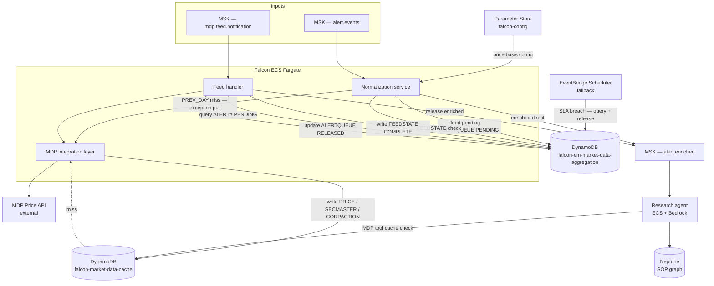

# Falcon — MDP Pricing Architecture & Design

**Version:** 3.2
**Status:** Draft for review
**Audience:** Falcon engineering, MDP integration, data operations

---

## 1. Overview

Falcon ingests pricing alerts from EPW and DAS, enriches each alert with prices from MDP (the firm's Bloomberg-sourced price store), and hands the enriched alert to a Research Agent for automated root-cause analysis. The Research Agent also has direct access to MDP data (prices, security master, corporate actions) via a tool backed by the same cache.

This document covers the end-to-end design: normalisation, price basis identification, feed notification handling, alert queuing, cache population, and the Research Agent MDP tool. It defines three DynamoDB tables (`falcon-market-data-cache`, `falcon-em-market-data-aggregation`), a config store (`falcon-config` via AWS Parameter Store), TTLs, and the AWS service mapping.

---

## 2. Scope

**In scope**
- Alert normalisation and routing
- Feed notification handling (MDP ready event per region + asset type)
- Alert hold queue (DynamoDB `falcon-em-market-data-aggregation` ALERTQUEUE entity) and release mechanism
- DynamoDB tables — `falcon-market-data-cache` (prices, security master, corporate actions) and `falcon-em-market-data-aggregation` (pipeline state)
- AWS Parameter Store — `falcon-config` (price basis configuration)
- Research Agent MDP tool
- AWS service mapping and architecture

**Out of scope (interfaces defined here, internals separate modules)**
- Price basis resolution logic (EPW valuation point → price type mapping, DAS default)
- INTRADAY implementation details (schema placeholder included)
- Price group / client onboarding workflow

---

## 3. Assumptions

### 3.1 Price Basis Module (separate)

The determination of which price type (PREV_DAY_CLOSE / CURR_DAY_CLOSE / INTRADAY) applies to an alert is owned by a **Price Basis Resolver** module. This document defines its interface only.

```
PriceBasisResolver.resolve(
  source:       "EPW" | "DAS",
  priceGroupId: string,
  region:       "EMEA" | "APAC" | "NAMR" | "LAMR",
  assetType:    string
) → PriceType: "PREV_DAY_CLOSE" | "CURR_DAY_CLOSE" | "INTRADAY"
```

The result is stored in **AWS Systems Manager Parameter Store** (`falcon-config`) and cached in-memory at Normalisation Service startup, refreshed every 15 minutes. Parameter Store is preferred over DynamoDB for this config data because it is versioned, auditable, and appropriate for small, rarely-changing config rather than high-throughput data.

### 3.2 MDP Feed Notification Signal

MDP publishes **one notification event per (region, assetType) per business day** once the full price load for that feed cell is complete. This is a signal only — no price data is included.

**Event payload (MSK topic `mdp.feed.notification`):**
```json
{
  "region":      "EMEA",
  "assetType":   "CommonStock",
  "businessDate": "2024-01-15",
  "notifiedAt":  "2024-01-15T16:35:00Z",
  "feedCellId":  "EMEA#CommonStock"
}
```

On receiving this event, Falcon calls MDP's price API to pull prices for the securities it needs.

### 3.3 Sync Service — Per-Security Exception Pull

When a price is needed immediately and cannot wait for the feed notification (PREV_DAY_CLOSE cache miss, or Research Agent tool cache miss), Falcon calls MDP's price API directly for that one security. This is the **exception pull** — the synchronous single-security path. It is not the primary flow and should not be used as a substitute for feed-driven cache population.

### 3.4 PREV_DAY_CLOSE Availability

PREV_DAY_CLOSE data is always retrievable from MDP (yesterday's feed has already completed by the time today's alerts arrive). If absent from cache, Falcon performs an exception pull. PREV_DAY_CLOSE alerts **never queue** against today's feed notification — they are independent of today's feed cycle.

### 3.5 INTRADAY

INTRADAY is a future extension. Schema includes it as a placeholder with the same structure as CURR_DAY_CLOSE. Processing logic falls through to CURR_DAY_CLOSE behaviour for now.

### 3.6 Security Universe — Organic Discovery (Option C)

There is no pre-defined security universe. The cache populates as alerts are processed and feed notifications arrive. On first encounter of a security, an exception pull warms the cache. Subsequent cycles use the feed-notification-driven path.

### 3.7 One Alert, One Security

Each alert references exactly one security. No multi-security alert batching is required at the alert level.

### 3.8 Price Basis at Client / Price Group Level

Price type is maintained at the client / price group level (not security level). The PRICEBASIS config stores the mapping `(priceGroupId, region, assetType) → priceType`. A security can have different price types for different price groups — the alert carries the `priceGroupId` used to resolve it. This config is managed in AWS Systems Manager Parameter Store (`falcon-config`), loaded at service startup, and refreshed every 15 minutes.

---

## 4. High-Level Flow

```
Alert arrives (from EPW or DAS)
  → MSK alert events topic

Normalisation Service (ECS Fargate)
  → parse: instrumentId, region, assetType, priceGroupId, businessDate
  → resolve price type via PriceBasisResolver (Parameter Store / in-memory cache)

  if priceType == PREV_DAY_CLOSE:
      → check falcon-market-data-cache (PRICE entity, previous businessDate)
      → HIT:  enrich alert → MSK enriched topic → Research Agent
      → MISS: exception pull from MDP → write to falcon-market-data-cache → enrich → Research Agent
      [never queue]

  if priceType == CURR_DAY_CLOSE or INTRADAY:
      → check falcon-em-market-data-aggregation: PK="{region}#{assetType}#{businessDate}", SK="FEEDSTATE"
      → COMPLETE: check falcon-market-data-cache price cache
                  → HIT:  enrich → Research Agent
                  → MISS: exception pull → write to falcon-market-data-cache → enrich → Research Agent
      → PENDING:  write to falcon-em-market-data-aggregation ALERTQUEUE
                  (PK="{region}#{assetType}#{businessDate}", SK="ALERT#{alertId}", status=PENDING)
                  [alert waits here durably until feed notification arrives]

MDP ready event arrives
  → MSK feed notification topic
  → Feed Handler (ECS Fargate)
      → idempotency: write falcon-em-market-data-aggregation FEEDSTATE = COMPLETE (conditional write)
                     PK="{region}#{assetType}#{businessDate}", SK="FEEDSTATE"
      → query falcon-em-market-data-aggregation: PK="{region}#{assetType}#{businessDate}", SK begins_with "ALERT#"
      → deduplicate instrumentIds across queued alerts
      → call MDP price API for all unique instruments
      → write prices to falcon-market-data-cache PRICE entities
      → enrich each queued alert with fetched price
      → publish enriched alerts to MSK enriched topic
      → update each falcon-em-market-data-aggregation ALERTQUEUE item: status = RELEASED

Research Agent (ECS + Bedrock)
  → receives enriched alert (primary price already attached)
  → uses MDP Tool for additional data (comparison prices, security master, corporate actions)
      → check falcon-market-data-cache → HIT: return | MISS: exception pull → write to falcon-market-data-cache → return
  → uses Neptune for SOP guidance
```

---

## 5. Component Design

### 5.1 Normalisation Service

**Runtime:** ECS Fargate, stateless, horizontally scalable.
**Input:** MSK `alert.events` topic.
**Output:** MSK `alert.enriched` topic (direct path) OR `falcon-em-market-data-aggregation` ALERTQUEUE write (hold path).

Responsibilities:
1. Parse alert and extract pricing context: `instrumentId`, `region`, `assetType`, `priceGroupId`, `businessDate`.
2. Resolve `priceType` via PriceBasisResolver (AWS Parameter Store `falcon-config`, in-memory cache).
3. Route by price type (see §4).
4. On exception pull: call MDP Integration Layer, write to `falcon-market-data-cache`, proceed.

### 5.2 Feed Notification Handler

**Runtime:** ECS Fargate (or Lambda if workload is bursty — one event per feed cell per day).
**Input:** MSK `mdp.feed.notification` topic.

Responsibilities:
1. Receive ready event.
2. Idempotency guard (conditional write to `falcon-em-market-data-aggregation` FEEDSTATE).
3. Query `falcon-em-market-data-aggregation` ALERTQUEUE for all PENDING alerts for the feed cell.
4. Deduplicate instruments across queued alerts.
5. Batch call MDP via MDP Integration Layer.
6. Write prices to `falcon-market-data-cache`.
7. Enrich and release all queued alerts.

### 5.3 MDP Integration Layer

**Runtime:** ECS Fargate, shared by Normalisation, Feed Handler, and Research Agent tool.

Centralised MDP client with:
- Connection pooling
- Rate limiting and backoff
- Circuit breaker
- Three methods: `getPrice()`, `getSecurityMaster()`, `getCorporateActions()`

### 5.4 Research Agent MDP Tool

Input: `(instrumentId, region, assetType, dataType, priceType?, businessDate?)`

```
1. Build falcon-market-data-cache key from inputs
2. Query falcon-market-data-cache
3. HIT  → return data to agent
4. MISS → call MDP Integration Layer
         → write to falcon-market-data-cache with standard TTL
         → return data to agent
```

Handles `dataType ∈ { PRICE, SECMASTER, CORPACTION }`.

---

## 6. Queue Logic — Detailed Design

### 6.1 Design Principle: DynamoDB as Authoritative Hold State

> **Design correction:** The original design used SQS FIFO as the alert holding mechanism. Two critical flaws were identified:
> 1. **No durable audit trail.** The SQS message was the only record that an alert was pending. Message expiry, DLQ loss, or crashes meant the alert silently disappeared with no record.
> 2. **SQS FIFO cannot be queried by MessageGroupId.** The `ReceiveMessage` API returns whatever is at the front of the queue regardless of group — you cannot ask SQS for "all messages in group EMEA#CommonStock#2024-01-15." The Feed Handler had no reliable mechanism to find pending alerts for a specific feed cell.
>
> **Fix:** DynamoDB `falcon-em-market-data-aggregation` table, with the feed cell as the partition key, is the authoritative, durable, queryable hold state. SQS is removed from the critical path.

| Job | Service |
|-----|---------|
| Hold state — who is waiting, for which feed cell | `falcon-em-market-data-aggregation` ALERTQUEUE entity |
| Feed cell completion state | `falcon-em-market-data-aggregation` FEEDSTATE entity |
| Delivery — enriched alerts to Research Agent | MSK `alert.enriched` topic |

### 6.2 ALERTQUEUE and FEEDSTATE Entities (`falcon-em-market-data-aggregation`)

Both entities share the same table with a unified partition key — the **feed cell** — which is the natural pivot for all pipeline state. This allows the Feed Handler to retrieve all state for a feed cell (both the completion flag and all queued alerts) in targeted, efficient queries.

**Table:** `falcon-em-market-data-aggregation`
**Partition key (PK):** `{region}#{assetType}` — e.g. `EMEA#CommonStock`
**Sort key (SK):** entity-type prefix + date (+ alertId for alerts)

| Entity | PK | SK | Example SK |
|--------|----|----|------------|
| FEEDSTATE | `{region}#{assetType}#{businessDate}` | `FEEDSTATE` | `FEEDSTATE` |
| ALERTQUEUE | `{region}#{assetType}#{businessDate}` | `ALERT#{alertId}` | `ALERT#uuid-001` |

**FEEDSTATE attributes:** `status` (PENDING \| COMPLETE), `notifiedAt`, `processedAt`, `securitiesFetched`, `ttl` (businessDate + 48 h)

**ALERTQUEUE attributes:**

| Attribute | Type | Description |
|-----------|------|-------------|
| `status` | String | PENDING \| RELEASED \| FAILED |
| `instrumentId` | String | Security identifier |
| `priceType` | String | CURR_DAY_CLOSE \| INTRADAY |
| `priceGroupId` | String | Client / price group |
| `alertPayload` | Map | Full normalised alert |
| `queuedAt` | ISO string | When the alert was parked |
| `releasedAt` | ISO string | Set when status → RELEASED |
| `ttl` | Epoch | queuedAt + 24 h (auto-expiry) |

**Access patterns for `falcon-em-market-data-aggregation`:**
- **Check feed state:** `GetItem PK="{region}#{assetType}#{businessDate}", SK="FEEDSTATE"`
- **Write feed state:** `UpdateItem PK="{region}#{assetType}#{businessDate}", SK="FEEDSTATE"`
- **Enqueue alert:** `PutItem PK="{region}#{assetType}#{businessDate}", SK="ALERT#{alertId}"`
- **Drain (FEEDSTATE + all alerts in one query):** `Query PK="{region}#{assetType}#{businessDate}"` then split client-side, or `begins_with(SK, "ALERT#")` for alerts only
- **Update alert status:** `UpdateItem PK="{region}#{assetType}#{businessDate}", SK="ALERT#{alertId}"`

### 6.3 Enqueue Condition (Normalisation Service)

An alert is parked in `falcon-em-market-data-aggregation` ALERTQUEUE only when **all** of the following are true:
- `priceType ∈ { CURR_DAY_CLOSE, INTRADAY }`
- `falcon-em-market-data-aggregation` FEEDSTATE for `(region, assetType, businessDate)` is PENDING or absent

If FEEDSTATE is COMPLETE when the alert arrives, proceed directly to `falcon-market-data-cache` price cache check — no queuing.

**Enqueue write:**
```
falcon-em-market-data-aggregation.put_item(
    PK           = "EMEA#CommonStock#2024-01-15",  # region#assetType#businessDate
    SK           = f"ALERT#{alertId}",              # ALERT#alertId
    status       = "PENDING",
    instrumentId = "US0231351067",
    priceType    = "CURR_DAY_CLOSE",
    priceGroupId = "PG001",
    alertPayload = { full normalised alert },
    queuedAt     = now(),
    ttl          = now() + 86400   # 24 h auto-expiry
)
```

### 6.4 Drain Process (Feed Notification Arrives)

**Step 1 — Idempotency guard**
```
falcon-em-market-data-aggregation.update_item(
    PK = "EMEA#CommonStock#2024-01-15",   # region#assetType#businessDate
    SK = "FEEDSTATE",                      # FEEDSTATE
    SET status = "COMPLETE", notifiedAt = now(),
    ConditionExpression = "attribute_not_exists(status) OR status = :pending"
)
```
If condition fails → already COMPLETE → stop. No reprocessing.

**Step 2 — Query all pending alerts for this feed cell and date**
```
items = falcon-em-market-data-aggregation.query(
    KeyConditionExpression = "PK = :pk AND begins_with(SK, :prefix)",
    ExpressionValues       = {
        ":pk":     "EMEA#CommonStock#2024-01-15",  # region#assetType#businessDate
        ":prefix": "ALERT#"                         # simple prefix — date already in PK
    }
    FilterExpression = "status = :pending"
)
# Returns ALL pending alerts for this feed cell and date.
# Date in PK means no date prefix in SK filter — cleaner, no cross-date risk.
```

**Step 3 — Deduplicate instruments**
```
uniqueInstruments = list({ item.instrumentId for item in items })
```

**Step 4 — Batch pull from MDP**
```
prices = MDP.batchGetPrices(
    instruments  = uniqueInstruments,
    priceType    = "CURR_DAY_CLOSE",
    businessDate = "2024-01-15"
)
# If MDP supports multi-security: one call.
# If single-security only: parallel calls, concurrency limit = 10.
```

**Step 5 — Write prices to `falcon-market-data-cache`**
```
for (instrument, price) in prices.items():
    falcon-market-data-cache.put_item(
        PK       = f"PRICE#{instrument}#EMEA#CommonStock",
        SK       = "CURR_DAY_CLOSE#2024-01-15",
        price    = price.value,
        currency = price.currency,
        source   = "MDP_FEED",
        cachedAt = now(),
        ttl      = next_midnight_epoch
    )
```

**Step 6 — Enrich and release each alert**
```
for item in items:
    price = falcon-market-data-cache.get_item(
        PK = f"PRICE#{item.instrumentId}#EMEA#CommonStock",
        SK = "CURR_DAY_CLOSE#2024-01-15"
    )
    enrichedAlert = { ...item.alertPayload, "price": price }
    MSK.publish("alert.enriched", enrichedAlert)

    falcon-em-market-data-aggregation.update_item(
        PK         = "EMEA#CommonStock#2024-01-15",  # region#assetType#businessDate
        SK         = item.SK,                          # ALERT#{alertId}
        SET status = "RELEASED",
        releasedAt = now()
    )
```

### 6.5 Recovery After Crash Mid-Drain

ALERTQUEUE items in `falcon-em-market-data-aggregation` remain PENDING until explicitly marked RELEASED. A Feed Handler crash at any step is fully recoverable:

```
Feed Handler restarts or receives duplicate notification:
→ Step 1: falcon-em-market-data-aggregation FEEDSTATE conditional write fails (already COMPLETE) → skip
→ Step 2: Query falcon-em-market-data-aggregation PK="EMEA#CommonStock#2024-01-15", SK begins_with "ALERT#" → returns only unreleased alerts
→ Steps 3–6: resume; MDP call is idempotent; falcon-market-data-cache price write is conditional
→ Each item marked RELEASED when done
```

Recovery is automatic. No SQS visibility timeout. No message replay ambiguity.

### 6.6 Error Handling

| Scenario | Handling |
|----------|----------|
| MDP call fails (retries exhausted) | `status → FAILED` in `falcon-em-market-data-aggregation` ALERTQUEUE. Publish to MSK enriched with `priceAvailable: false`. CloudWatch alarm. |
| MDP returns no price for a specific instrument | That instrument's alerts: `status → FAILED`, `priceAvailable: false`. Others proceed normally. |
| Feed Handler crashes mid-drain | On restart: `falcon-em-market-data-aggregation` still shows PENDING items. Query at Step 2 returns only unreleased alerts. Resume from Step 4. |
| Duplicate feed notification | Idempotency guard at Step 1 stops processing. Step 2 query returns zero PENDING items if already released — safe no-op. |
| Feed notification never arrives | `falcon-em-market-data-aggregation` ALERTQUEUE TTL auto-expires items after 24 h. EventBridge Scheduler queries for PENDING items older than feed SLA window and releases with `priceAvailable: false`. CloudWatch alarm. |
| Operations visibility | At any time: query `falcon-em-market-data-aggregation` PK="{region}#{assetType}#{businessDate}" to see all PENDING, RELEASED, FAILED alerts for a feed cell on any date. |

### 6.7 PREV_DAY_CLOSE Fast Path

```
1. priceType = PREV_DAY_CLOSE
2. falcon-market-data-cache get: PK="PRICE#{instrumentId}#{region}#{assetType}" SK="PREV_DAY_CLOSE#{yesterday}"
3. HIT  → enrich → MSK alert.enriched → Research Agent
4. MISS → MDP exception pull → falcon-market-data-cache put (TTL = 48 h) → enrich → publish
```

Never written to `falcon-em-market-data-aggregation`. Never waits for today's feed notification. This is the **exception pull** (sync service per security) for PREV_DAY_CLOSE.

### 6.8 Idempotency Summary

| Component | Mechanism |
|-----------|-----------|
| Feed Handler activation | `falcon-em-market-data-aggregation` conditional write — PK="{region}#{assetType}#{businessDate}", SK="FEEDSTATE", condition: status != COMPLETE |
| ALERTQUEUE write | `put_item` on same SK (ALERT#date#alertId) is safe to replay |
| ALERTQUEUE release | Update to RELEASED is a no-op if already RELEASED |
| `falcon-market-data-cache` price write | Conditional on `attribute_not_exists(cachedAt)` unless explicit refresh |
| Exception pull dedup | Application-level single-flight per `(instrumentId, priceType, businessDate)` |

---

## 7. DynamoDB Schema

### 7.1 Design Principles

**Three-table design** — entities are separated by lifecycle and access pattern, not crammed into one table. Single-table design was rejected because the entities have fundamentally different volumes, TTLs, owners, and access patterns; co-locating them would couple capacity planning and obscure operational metrics.

| Table | Entities | Rationale |
|-------|----------|-----------|
| `falcon-market-data-cache` | PRICE, SECMASTER, CORPACTION | MDP-sourced data; Research Agent accesses all three for the same instrument in one investigation; different PKs per entity type prevent partition competition |
| `falcon-em-market-data-aggregation` | ALERTQUEUE, FEEDSTATE | Feed cell + businessDate as PK; co-owned by same two services; all transient (24–48 h TTL); one query retrieves FEEDSTATE and all alerts for a cell and date |
| `falcon-config` (Parameter Store) | PRICEBASIS | Config data; no TTL; versioned and auditable; appropriate for small, rarely-changing lookups — not a high-throughput workload |

**Common conventions across tables:**
- **TTL attribute:** `ttl` (Unix epoch, numeric) on every item that expires
- **PK prefix convention within each table:** entity type prefix prevents PK collisions between entity types sharing a table
- **On-demand billing:** recommended for `falcon-market-data-cache` (unpredictable write spikes during feed windows) and `falcon-em-market-data-aggregation` (bursty during drain)

---

### 7.2 Table: `falcon-market-data-cache`

**Purpose:** Durable cache for all MDP-sourced instrument data accessed by the Research Agent tool and the Normalisation Service on exception pull.
**Partition key (PK):** string
**Sort key (SK):** string
**TTL attribute:** `ttl`

---

#### Entity: PRICE

| Key | Pattern | Example |
|-----|---------|---------|
| PK | `PRICE#{instrumentId}#{region}#{assetType}` | `PRICE#US0231351067#EMEA#CommonStock` |
| SK | `{priceType}#{businessDate}` | `CURR_DAY_CLOSE#2024-01-15` |

**Attributes:** `price` (Decimal), `currency` (String), `source` (MDP_FEED \| MDP_EXCEPTION), `feedCell` (String), `cachedAt` (ISO), `ttl` (epoch)

**TTL by price type:**

| Price type | TTL |
|------------|-----|
| PREV_DAY_CLOSE | businessDate + 48 h (covers weekend rollover) |
| CURR_DAY_CLOSE | businessDate + 24 h |
| INTRADAY | businessDate + 12 h |

**Write path:** feed notification handler (bulk, MDP_FEED source) and exception pull (single-security, MDP_EXCEPTION source).
**Read path:** Normalisation Service (cache check before exception pull) and Research Agent MDP tool.

---

#### Entity: SECURITY_MASTER

| Key | Pattern | Example |
|-----|---------|---------|
| PK | `SECMASTER#{instrumentId}` | `SECMASTER#US0231351067` |
| SK | `{asOfDate}` | `2024-01-15` |

**Attributes:** `name`, `isin`, `cusip`, `assetType`, `region`, `exchange`, `currency`, `status` (ACTIVE \| INACTIVE), `cachedAt`, `ttl`

**TTL:** cachedAt + 24 h
**Write path:** exception pull only (Research Agent tool on cache miss).
**Read path:** Research Agent MDP tool point lookup by today's date.

---

#### Entity: CORPORATE_ACTION

| Key | Pattern | Example |
|-----|---------|---------|
| PK | `CORPACTION#{instrumentId}` | `CORPACTION#US0231351067` |
| SK | `{effectiveDate}#{actionType}#{actionId}` | `2024-01-15#DIVIDEND#CA001` |

**Attributes:** `actionType` (DIVIDEND \| SPLIT \| MERGER \| SPIN_OFF), `amount`, `currency`, `ratio`, `exDate`, `payDate`, `cachedAt`, `ttl`

**TTL:** effectiveDate + 30 days
**Write path:** exception pull only (Research Agent tool on cache miss).
**Read path:** Research Agent MDP tool range scan — query PK with SK between `{fromDate}#` and `{toDate}~`.

---

### 7.3 Table: `falcon-em-market-data-aggregation`

**Purpose:** Durable, queryable pipeline state. Holds the feed completion status and all pending alerts for each feed cell on each business day. All data is transient and auto-expires via TTL.
**Partition key (PK):** `{region}#{assetType}#{businessDate}` — feed cell + business date (e.g. `EMEA#CommonStock#2024-01-15`)
**Sort key (SK):** entity-type prefix + date
**TTL attribute:** `ttl`

The feed cell + businessDate as PK is the key design insight: every access to this table is scoped to a specific (feed cell, date) pair. A single `Query PK="EMEA#CommonStock#2024-01-15"` returns both the FEEDSTATE record and all ALERTQUEUE items — no date prefix required in the SK filter and no cross-date contamination is possible.

---

#### Entity: FEEDSTATE

| Key | Pattern | Example |
|-----|---------|---------|
| PK | `{region}#{assetType}#{businessDate}` | `EMEA#CommonStock#2024-01-15` |
| SK | `FEEDSTATE` | `FEEDSTATE` |

**Attributes:** `status` (PENDING \| COMPLETE), `notifiedAt`, `processedAt`, `securitiesFetched` (Number), `ttl`

**TTL:** businessDate + 48 h
**Write path:** Feed Handler on notification arrival (conditional update).
**Read path:** Normalisation Service — `GetItem PK="{region}#{assetType}#{businessDate}", SK="FEEDSTATE"` — checks completion before queuing or passing through.

---

#### Entity: ALERTQUEUE

| Key | Pattern | Example |
|-----|---------|---------|
| PK | `{region}#{assetType}#{businessDate}` | `EMEA#CommonStock#2024-01-15` |
| SK | `ALERT#{alertId}` | `ALERT#uuid-001` |

**Attributes:** `status` (PENDING \| RELEASED \| FAILED), `instrumentId`, `priceType`, `priceGroupId`, `alertPayload` (Map), `queuedAt` (ISO), `releasedAt` (ISO), `ttl`

**TTL:** queuedAt + 24 h
**Write path:** Normalisation Service on enqueue. Feed Handler on release/fail.
**Read path:** Feed Handler drain query — `Query PK="EMEA#CommonStock#2024-01-15", SK begins_with "ALERT#"`. Date in PK, no date prefix needed in SK filter.

---

### 7.4 Config Store: `falcon-config` (AWS Parameter Store)

**Purpose:** Price basis configuration — the mapping from `(priceGroupId, region, assetType)` to `priceType`. This is configuration data, not a transactional workload. Parameter Store provides versioning, change history, and IAM-controlled access appropriate for config management.

**Parameter naming convention:** `/falcon/pricebasis/{priceGroupId}/{region}/{assetType}`
**Value:** JSON — `{ "priceType": "CURR_DAY_CLOSE", "effectiveFrom": "2024-01-01" }`
**TTL:** none (config — manually updated by ops)

Services load all PRICEBASIS parameters at startup into an in-memory map and refresh every 15 minutes via Parameter Store GetParametersByPath.

---

### 7.5 GSIs

**`falcon-market-data-cache`:** No GSI required. All access patterns are point lookups or range scans on the main key. Add a GSI if operational reporting (e.g. "list all prices for a feed cell") becomes a requirement.

**`falcon-em-market-data-aggregation`:** No GSI required. The (feed cell + businessDate) PK means all drain queries are fully targeted by PK. The EventBridge fallback constructs PKs from known feed cells (timing matrix) and specific dates — no table scan needed.

---

### 7.6 TTL Summary

| Table | Entity | TTL |
|-------|--------|-----|
| `falcon-market-data-cache` | PRICE — PREV_DAY_CLOSE | businessDate + 48 h |
| `falcon-market-data-cache` | PRICE — CURR_DAY_CLOSE | businessDate + 24 h |
| `falcon-market-data-cache` | PRICE — INTRADAY | businessDate + 12 h |
| `falcon-market-data-cache` | SECURITY_MASTER | cachedAt + 24 h |
| `falcon-market-data-cache` | CORPORATE_ACTION | effectiveDate + 30 days |
| `falcon-em-market-data-aggregation` | FEEDSTATE | businessDate + 48 h |
| `falcon-em-market-data-aggregation` | ALERTQUEUE | queuedAt + 24 h |
| `falcon-config` | PRICEBASIS (Parameter Store) | no TTL (config) |

---

## 8. End-to-End Flows

### 8.1 PREV_DAY_CLOSE — Fast Path

```
Alert: instrumentId=X, priceGroupId=PG001, region=EMEA, assetType=CommonStock
PriceBasisResolver (Parameter Store) → PREV_DAY_CLOSE

falcon-market-data-cache get: PK="PRICE#X#EMEA#CommonStock" SK="PREV_DAY_CLOSE#2024-01-14"
→ HIT:  enrich → MSK enriched topic → Research Agent       (~<50 ms)
→ MISS: MDP.getPrice(X, PREV_DAY_CLOSE, 2024-01-14)
        → falcon-market-data-cache put (TTL = 48 h)
        → enrich → Research Agent                           (~<500 ms)
```

### 8.2 CURR_DAY_CLOSE — Feed Not Yet Arrived

```
Alert: X, CURR_DAY_CLOSE, 2024-01-15, EMEA, CommonStock

# Check feed state
falcon-em-market-data-aggregation get: PK="EMEA#CommonStock#2024-01-15", SK="FEEDSTATE" → status=PENDING

# Queue the alert
falcon-em-market-data-aggregation put:
    PK = "EMEA#CommonStock#2024-01-15",  # region#assetType#businessDate
    SK = f"ALERT#{alertId}",              # ALERT#alertId
    status = PENDING, instrumentId = X, alertPayload = { full alert }, ttl = now+24h

[alert waits durably in falcon-em-market-data-aggregation]

MDP publishes ready event: { region:EMEA, assetType:CommonStock, businessDate:2024-01-15 }
Feed Handler:
  1. falcon-em-market-data-aggregation update: PK="EMEA#CommonStock#2024-01-15", SK="FEEDSTATE"
     → status=COMPLETE (conditional write — idempotency guard)
  2. falcon-em-market-data-aggregation query: PK="EMEA#CommonStock#2024-01-15", SK begins_with "ALERT#"
     → returns all pending alerts [X, Y, Z, ...]
  3. uniqueInstruments = [X, Y, Z]
  4. MDP.batchGetPrices([X,Y,Z], CURR_DAY_CLOSE, 2024-01-15)
  5. falcon-market-data-cache put: PRICE entities for X, Y, Z
  6. For each alert: enrich → MSK alert.enriched → Research Agent
  7. falcon-em-market-data-aggregation update each: PK="EMEA#CommonStock#2024-01-15", SK="ALERT#{alertId}", status=RELEASED
```

### 8.3 CURR_DAY_CLOSE — Feed Already Received

```
Alert arrives after falcon-em-market-data-aggregation FEEDSTATE = COMPLETE for that feed cell.

falcon-em-market-data-aggregation get: PK="EMEA#CommonStock#2024-01-15", SK="FEEDSTATE" → COMPLETE
falcon-market-data-cache get: PK="PRICE#X#EMEA#CommonStock", SK="CURR_DAY_CLOSE#2024-01-15"
  HIT:  enrich → Research Agent
  MISS: MDP exception pull → falcon-market-data-cache put → enrich → Research Agent
```

### 8.4 Research Agent Tool Lookup

```
Agent needs corporate actions for instrument Z, EMEA, CommonStock, 2024-01-01 to 2024-01-31

falcon-market-data-cache query:
    PK = "CORPACTION#Z"
    SK between "2024-01-01#" and "2024-01-31~"
  HIT:  return to agent
  MISS: MDP.getCorporateActions(Z, 2024-01-01, 2024-01-31)
        → falcon-market-data-cache put each action (TTL = effectiveDate + 30 days)
        → return to agent
```

Same pattern applies for SECMASTER (point lookup) and PRICE lookups.

---

## 9. Edge Cases

| Scenario | Handling |
|----------|----------|
| Feed notification arrives before any alerts | `falcon-em-market-data-aggregation` FEEDSTATE written COMPLETE. Subsequent alerts for that cell see COMPLETE and go to `falcon-market-data-cache` cache check directly — no queuing. |
| Multiple alerts for the same instrument queued | Deduplication at Step 3 of drain process. One MDP call per unique instrument. |
| MDP returns partial results | Instruments with prices proceed. Missing instruments: `priceAvailable: false`. CloudWatch metric incremented. |
| Duplicate feed notification | Idempotency guard (conditional write) prevents reprocessing. |
| PREV_DAY_CLOSE on Monday | businessDate = Friday. `falcon-market-data-cache` cache check for Friday's close. Exception pull if not cached. |
| New security, never cached | `falcon-market-data-cache` miss → exception pull → populate → proceed. |
| Feed never arrives | `falcon-em-market-data-aggregation` ALERTQUEUE TTL auto-expires after 24 h. EventBridge Scheduler queries known feed cells for PENDING items older than SLA window, releases with `priceAvailable: false`. CloudWatch alarm. |
| MDP API unavailable at drain time | Retry ×3 with backoff. After exhaustion: `falcon-em-market-data-aggregation` ALERTQUEUE status → FAILED, publish to MSK enriched with `priceAvailable: false`. Circuit breaker opens after threshold. |
| System restart mid-drain | `falcon-em-market-data-aggregation` ALERTQUEUE items remain PENDING. On restart, Feed Handler re-checks FEEDSTATE (COMPLETE), re-queries ALERT# items, resumes from Step 4. No message replay needed. |
| CURR_DAY_CLOSE alert on a non-trading day | No MDP notification will arrive. Alert stays PENDING in `falcon-em-market-data-aggregation` until TTL expiry, then EventBridge releases with `priceAvailable: false`. |

---

## 10. AWS Architecture

### 10.1 Service Mapping

| Concern | AWS Service | Notes |
|---------|-------------|-------|
| Alert events | Amazon MSK (Kafka) | `alert.events` topic |
| Feed notification events | Amazon MSK (Kafka) | `mdp.feed.notification` topic |
| Enriched alerts | Amazon MSK (Kafka) | `alert.enriched` topic → Research Agent |
| Normalisation service | ECS Fargate | Stateless consumers, auto-scale by topic lag |
| Feed notification handler | ECS Fargate or Lambda | One event per feed cell per day |
| MDP integration layer | ECS Fargate | Connection pool, rate limiter, circuit breaker |
| Market data cache | Amazon DynamoDB — `falcon-market-data-cache` | PRICE, SECMASTER, CORPACTION; on-demand billing; TTL-based expiry |
| Pipeline state | Amazon DynamoDB — `falcon-em-market-data-aggregation` | ALERTQUEUE + FEEDSTATE; PK = feed cell + businessDate; all data transient, 24–48 h TTL |
| Price basis config | AWS Systems Manager Parameter Store | PRICEBASIS config; versioned; loaded in-memory at startup |
| Failure / expiry handling | Amazon EventBridge Scheduler + CloudWatch | Queries `falcon-em-market-data-aggregation` for PENDING items older than feed SLA; releases with priceAvailable=false |
| Research Agent | ECS Fargate + Amazon Bedrock | LLM + MDP tool + Neptune SOP |
| SOP knowledge graph | Amazon Neptune | SOP graphs, research rules |
| MDP credentials | AWS Secrets Manager | Rotated credentials for MDP API |
| Observability | Amazon CloudWatch + AWS X-Ray | Metrics, alarms, distributed tracing |

### 10.2 Architecture Diagram (Mermaid)



---

## 11. Open Items

| # | Item | Owner | Impact |
|---|------|-------|--------|
| 1 | Price basis resolver internals | EPW/DAS + Falcon | EPW valuation point → priceType mapping; DAS default |
| 2 | INTRADAY — point in time definition | Falcon + MDP | Which intraday snapshot, how MDP exposes it |
| 3 | MDP batch API availability | MDP team | Determines drain efficiency (one call vs N parallel calls) |
| 4 | Price group onboarding process | Product / Ops | How PRICEBASIS config is managed in Parameter Store |
| 5 | Security master refresh frequency | Data team | 24 h TTL assumed; confirm if near-real-time required |
| 6 | Corporate actions freshness SLA | Data team | 30-day TTL assumed; confirm event-driven invalidation need |
| 7 | EventBridge fallback threshold | Falcon + MDP | How long to wait past timing-matrix "latest" before triggering fallback |
| 8 | SECMASTER / CORPACTION MDP notification | MDP team | Does MDP send a separate feed-complete notification for security master and corporate action updates? If yes, `falcon-em-market-data-aggregation` FEEDSTATE should track those feed types too and the bulk-load path applies. If no, SECMASTER and CORPACTION remain exception-pull only. |

---

*This document supersedes earlier design drafts from the Falcon pricing design thread. All assumptions in §3 must be confirmed before implementation.*
